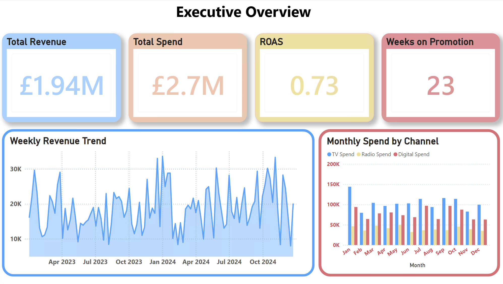
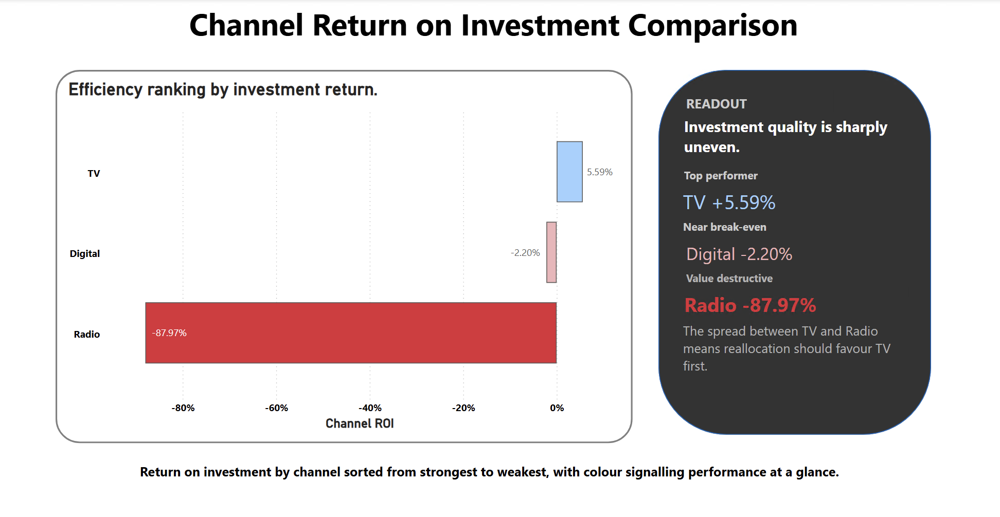
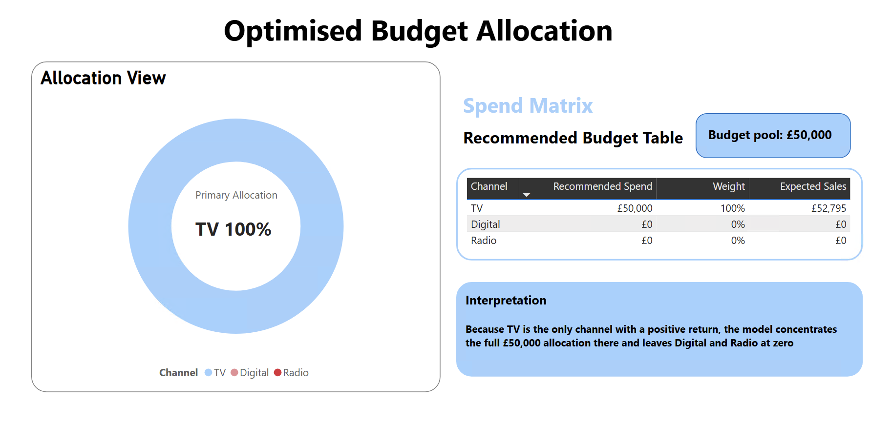
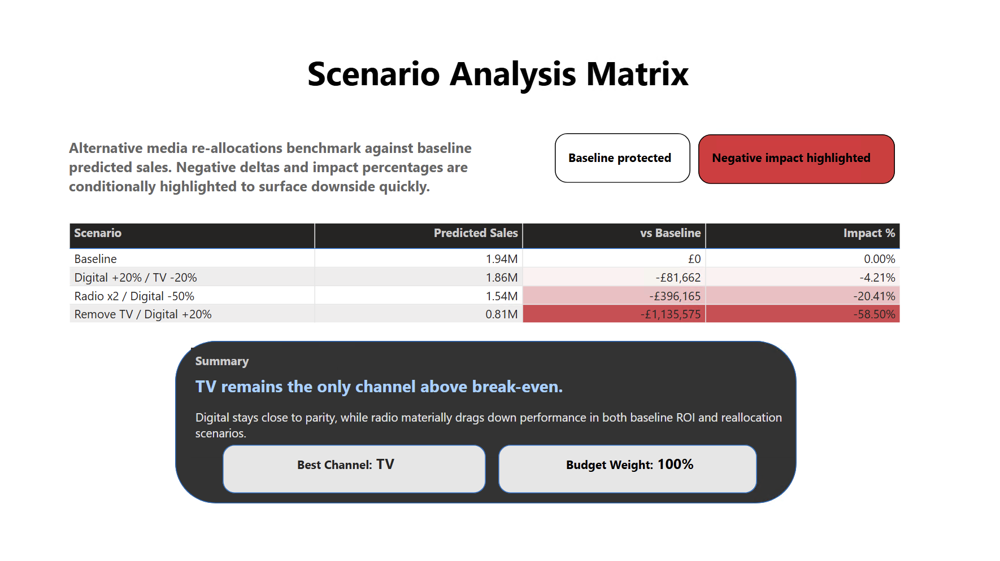

# ROI Optimizer | Marketing Mix Model
Portfolio-ready marketing mix modelling project that estimates channel ROI and turns model outputs into budget allocation decisions for a UK brand.
**Tech Stack:** Python, Pandas, Statsmodels, Matplotlib, Power BI

## Project Overview
This project answers a practical budget question: if a business is already spending across TV, digital, and radio, where should the next pound go for the strongest commercial return?

The workflow covers synthetic data generation, exploratory analysis, adstock transformation, OLS regression, ROI calculation, budget optimisation, scenario analysis, and a 4-page Power BI dashboard.

## Business Question
How should a brand allocate its media budget when it wants evidence on channel efficiency rather than instinct or legacy planning?

## Dataset
- 104 weekly observations across two years
- Channels: TV, digital, and radio spend
- Control variable: `promo_flag`
- Outcome variable: weekly sales
- Total sales in the modelling window: £1.94M
- Total marketing spend in the modelling window: £2.66M

## Methodology
1. Generated and inspected a 2-year weekly marketing dataset.
2. Measured channel relationships with sales through correlations, scatter plots, and a weekly trend view.
3. Applied adstock to capture media carry-over effects.
4. Built an OLS regression with adstocked channel variables plus `promo_flag`.
5. Converted model outputs into ROI by channel and a budget allocation recommendation.
6. Tested three reallocation scenarios and surfaced the outcome in Power BI.

## Key Results
| Metric | Result |
|--------|--------|
| Model R-squared | 0.715 |
| Significant channels | TV and Digital |
| Non-significant channel | Radio (p = 0.6199) |
| Best return per £1 spent | TV at £1.06 |
| Digital return per £1 spent | £0.98 |
| Radio return per £1 spent | £0.12 |
| £1,000 recommended allocation | 100% to TV |
| Worst reallocation outcome | Removing TV cuts predicted sales by 58.50% |

## Channel ROI
| Channel | Coefficient | Avg Weekly Spend | Avg Adstock | Return per £1 | ROI |
|---------|-------------|-----------------|-------------|---------------|-----|
| TV | 0.4281 | £11,996.47 | £29,592.65 | £1.06 | +5.59% |
| Digital | 0.6875 | £8,937.62 | £12,714.81 | £0.98 | -2.20% |
| Radio | 0.0724 | £4,666.85 | £7,750.90 | £0.12 | -87.97% |

## Scenario Analysis
| Scenario | Predicted Sales | vs Baseline | Impact % |
|----------|----------------|-------------|----------|
| Baseline | £1,941,047 | £0 | 0.00% |
| Digital +20% / TV -20% | £1,859,385 | -£81,662 | -4.21% |
| Radio x2 / Digital -50% | £1,544,882 | -£396,165 | -20.41% |
| Remove TV / Digital +20% | £805,472 | -£1,135,575 | -58.50% |

## Business Recommendation
- Keep TV as the lead channel because it is the only one currently above break-even.
- Reduce or redesign radio spend because it destroys value at current efficiency.
- Review digital targeting and creative effectiveness before increasing spend.
- Use scenario testing before any quarterly budget reallocation rather than shifting spend on intuition alone.

## Dashboard Preview
### Page 1: Executive Overview


### Page 2: Channel ROI Comparison


### Page 3: Optimised Budget Allocation


### Page 4: Scenario Analysis


## Files To Review First
- `README.md` for the business story and headline results
- `project_notes.md` for the day-by-day modelling build
- `presentation_notes.md` for the interview walkthrough and Q&A
- `outputs/mmm_model_summary.txt` for the regression output
- `outputs/correlation_matrix.csv` for the initial channel relationship summary
- `outputs/scenario_comparison.csv` and `outputs/roi_by_channel.csv` for the recommendation tables
- `powerbi/Project3_MMM_Dashboard_Final.pbix` for the finished dashboard

## Project Structure
```text
roi_optimizer/
|-- data/
|   |-- marketing_data.csv
|   |-- mmm_data_adstocked.csv
|   |-- correlation_matrix.csv
|   `-- roi_by_channel.csv
|-- scripts/
|   |-- 01_inspect.py
|   |-- 01_eda.py
|   |-- 02_mmm_model.py
|   |-- 03_adstock.py
|   |-- 03_roi_calculator.py
|   |-- 04_budget_optimizer.py
|   `-- 05_scenario_analysis.py
|-- outputs/
|   |-- correlation_matrix.csv
|   |-- scatter_*.png
|   |-- tv_adstock_plot.png
|   |-- roi_by_channel.csv
|   |-- roi_by_channel.png
|   |-- budget_allocation.png
|   |-- scenario_comparison.csv
|   `-- mmm_model_summary.txt
|-- powerbi/
|   |-- Project3_MMM_Dashboard_Final.pbix
|   |-- day67_executive_overview.png
|   |-- day67_channel_roi_comparison.png
|   |-- day67_optimised_budget_allocation.png
|   `-- day69_scenario_analysis_matrix.png
|-- project_notes.md
|-- presentation_notes.md
`-- README.md
```

## How To Run
Install dependencies and run the pipeline from the repo root:

```bash
python3 -m venv .venv
source .venv/bin/activate
pip install -r requirements.txt
chmod +x run_mmm.sh
./run_mmm.sh
```

If you prefer to run each step manually, use:

```bash
python scripts/01_inspect.py
python scripts/01_eda.py
python scripts/03_adstock.py
python scripts/02_mmm_model.py
python scripts/03_roi_calculator.py
python scripts/04_budget_optimizer.py --budget 1000
python scripts/05_scenario_analysis.py
```

To inspect the final dashboard, open:

```text
powerbi/Project3_MMM_Dashboard_Final.pbix
```
